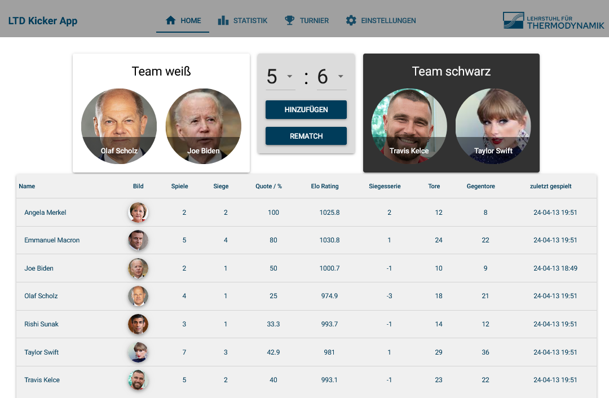

# Kicker App

App for saving foosball games and providing statistics.

> [!IMPORTANT]  
> The app is not actively developed here. A current version of the app [here](https://gitlab.rhrk.uni-kl.de/schmitts/kicker-app).

## Installation

NOTE: Currently does not run with Python 3.12. Definitely runs with [Python 3.11](https://www.python.org/downloads/release/python-3115/).

To install all required packages, run the following command:

```
pip install -r requirements.txt
```

## Screenshot


